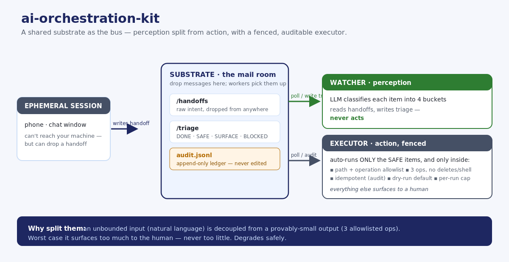

# ai-orchestration-kit

A small framework for **orchestrating an always-on AI agent from ephemeral sessions** — using a
shared **substrate** (a folder / Drive / bucket) as the message bus. Think of it as a **mail room**: senders drop messages, workers pick them up, and nobody calls anyone directly. Drop a handoff from anywhere
(your phone, a chat), and a background watcher classifies it; a separate executor auto-runs only the
items proven safe, inside a hard boundary. Standard library only.




## The idea

You're on your phone. You think of six things that need doing back on your real machine. You write
them down — and normally they rot in a note. Here, you drop them as a **handoff** into a shared
folder. Two background roles pick it up:

- **Watcher** (surface-only) — reads each new handoff, asks an LLM to sort every item into
  **DONE / SAFE / SURFACE / BLOCKED**, and writes a triage doc back to the substrate. It never acts.
- **Executor** (autonomous, boundaried) — reads the triage and auto-runs *only* the **SAFE** items,
  and only inside a strict allowlist. Everything else waits for a human.

```bash
pip install -e .

# 1) classify new handoffs sitting in ./substrate into triage docs
orchestrate watch --store ./substrate

# 2) auto-run the SAFE actions from a triage — dry-run first
orchestrate execute --triage ./substrate/triage/2026-07-16-handoff.md \
  --allow "./inbox" "./tasks.md"
# add --apply to actually execute
```

## The safety model (the important part)

Autonomous execution is only as good as its guardrails. The executor enforces, on every action:

1. **Path allowlist** + forbidden-substring deny — writes only to approved prefixes; never anything
   matching `secret`, `.env`, `password`, `token`, `credential`.
2. **Operation allowlist** — only `MARK_COMPLETE`, `APPEND_NOTE`, `MIRROR_WRITE`. No deletes, no shell.
3. **Idempotency** — every action is hashed and recorded in an **append-only audit log**; re-running a
   triage never re-executes an action.
4. **Dry-run by default** — nothing happens until you pass `--apply`.
5. **Per-run cap** — a hard limit on actions per run.

The design goal: let the agent safely handle the ~20% of items that are unambiguous, and *surface*
the other 80% instead of guessing. See [docs/ARCHITECTURE.md](docs/ARCHITECTURE.md).

## Pluggable pieces

- **Store** — `LocalStore` (a folder) is the reference backend; match its small interface to back it
  with Drive, S3, or GCS.
- **Classifier** — ships an LLM classifier (DeepSeek-first, Anthropic fallback), but any
  `callable(handoff_text) -> triage_markdown` works.

## License

MIT — see [LICENSE](LICENSE).
